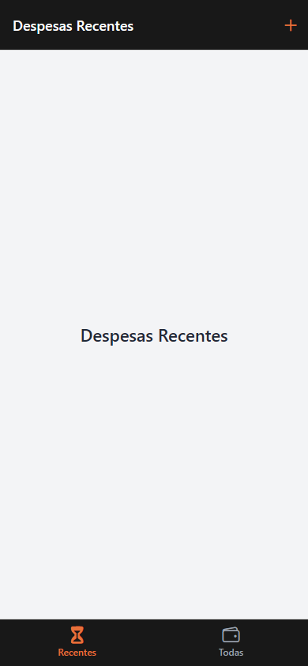
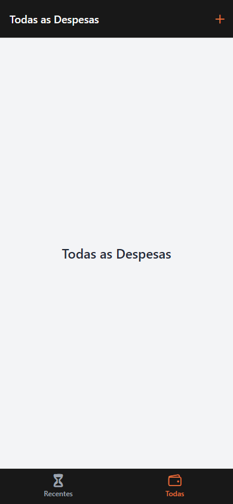
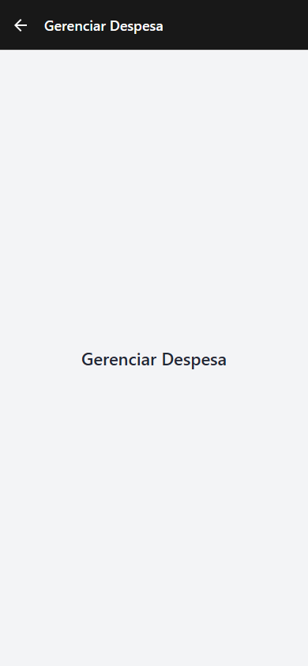

# Atividade — Navegação entre telas

**Disciplina:** Programação para Dispositivos Móveis (React Native / Expo)
**Aula relacionada:** 07 — Navegação

## Objetivo

Construir a estrutura de navegação de um aplicativo de controle de despesas, usando Bottom Tabs dentro de um Native Stack e um botão reutilizável com ícone.

## O que foi feito

Criei o projeto com o template blank do Expo e SDK 57. Mantive JavaScript, os estilos com StyleSheet no final de cada arquivo e a paleta cinza, preto e laranja das práticas 5 e 6.

As três telas mostram uma View centralizada com o nome da tela, conforme o enunciado. Esta atividade trabalha a navegação; o cadastro e a lista de despesas ainda não fazem parte desta etapa.

## Estrutura do projeto

```text
Atividade-screen/
├── App.js
├── app.json
├── index.js
├── package.json
├── package-lock.json
├── README.md
├── assets/
├── components/
│   └── IconButton.js
├── screens/
│   ├── DespesasRecentes.js
│   ├── TodasDespesas.js
│   └── GerenciarDespesa.js
├── screenshots/
└── styles/
    └── colors.js
```

## Como executar

```bash
cd praticas/Atividade-screen
npm install
npx expo start
```

Abra pelo Expo Go compatível com o SDK 57. Para conferir no navegador:

```bash
npm run web
```

O projeto foi criado com:

```bash
npx create-expo-app@latest Atividade-screen --template expo-template-blank@sdk-57
npm install @react-navigation/native@^7 @react-navigation/bottom-tabs@^7 @react-navigation/native-stack@^7
npx expo install react-native-screens react-native-safe-area-context @expo/vector-icons expo-font
npx expo install react-dom react-native-web @expo/metro-runtime
```

## Como a navegação funciona

O App.js tem as constantes Tab e Stack. A função BottomTabScreen retorna as abas Recentes e Todas. Cada aba possui seu título e ícone do Ionicons: hourglass e wallet-outline. O tamanho do rótulo é 12.

O NavigationContainer envolve o Native Stack. A primeira tela, Despesas, mostra o BottomTabScreen com headerShown: false, evitando dois cabeçalhos. A segunda tela é GerenciarDespesa.

Em screenOptions das abas, headerRight recebe o IconButton. O botão usa o ícone add e chama navigation.navigate('GerenciarDespesa'). Ao voltar pela seta do cabeçalho, a aba que estava selecionada é mantida.

## Componente IconButton

O componente recebe as props desestruturadas icon, size, color e onPress. Dentro do Pressable há uma View com Ionicons. O estado pressed aplica opacity: 0.5 enquanto o botão está pressionado.

Os componentes usam export default. A paleta colors usa export nomeado e é importada com chaves.

## Prints e verificação

Capturas reais da versão web em uma janela de 390 × 844 pixels. Não são prints de um celular físico.

### Despesas recentes



### Todas as despesas



### Gerenciar despesa



### Verificações realizadas

- Troca entre Recentes e Todas, com título e aba selecionada correspondentes.
- Abertura de Gerenciar Despesa pelo botão + nas duas abas.
- Retorno pela seta do cabeçalho à aba de origem.
- Barra de abas oculta ao abrir Gerenciar Despesa.
- Opacidade 0,5 enquanto o botão está pressionado.
- Ícones e textos visíveis nas três capturas.
- Sem rolagem horizontal em uma janela de 320 pixels de largura.
- Sem erros de execução no navegador durante o fluxo.
- Dependências compatíveis com o SDK 57: npx expo install --check.
- Expo Doctor: 21 de 21 verificações aprovadas.
- Exportação web e Android concluída com npx expo export --platform web --platform android.

A exportação Android verifica a geração do pacote JavaScript; o aplicativo não foi executado em um dispositivo Android ou iOS nesta conferência.

A auditoria do npm registrou 22 avisos (7 moderados e 15 altos) nas dependências. Não apliquei npm audit fix --force, pois as sugestões incluem trocar Expo e React Native por versões incompatíveis com o SDK 57.

## Referências

- Material da Aula 07 disponibilizado em pratica07.
- [Catálogo de ícones Ionicons](https://ionic.io/ionicons/).
- [Navegadores aninhados — React Navigation](https://reactnavigation.org/docs/nesting-navigators/).
- [Bottom Tabs — React Navigation](https://reactnavigation.org/docs/bottom-tab-navigator/).
