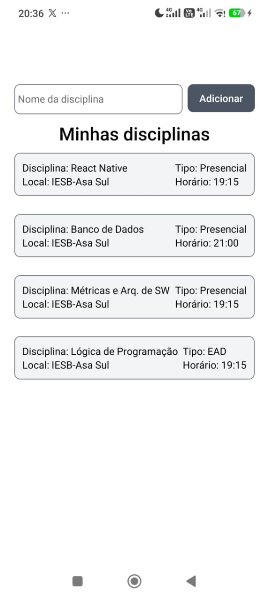

## Tela da aplicação



## Comandos Utilizados

1. Criar o ambiente:  
```bash 
npx create-expo-app@latest MeuDiarioAcademico --template blank
```

2. Criar o safe area content foi necessário instalar mais uma dependência:
```bash
npx expo install react-native-safe-area-context
```
3. Iniciar o Expo Go
```bash
cd MeuDiarioAcademico
npx expo start
```