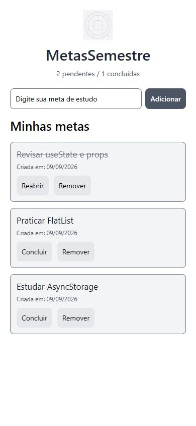

# Prática 05 — MetasSemestre

**Disciplina:** Programação para Dispositivos Móveis (React Native / Expo)
**Professor:** Marcelo Alves Farias — IESB
**Aulas relacionadas:** 05 e 06

## Objetivo e enunciado

Aplicar useState, props, componentização, Pressable, useEffect e AsyncStorage em um app de metas acadêmicas com persistência local.

Evoluir (ou recriar) o app de metas **MetasSemestre**. O aluno cadastra metas de estudo, remove itens e os dados sobrevivem ao fechar o aplicativo. Desenvolver na pasta `pratica05`.

### Preparação indicada

```bash
npx create-expo-app@latest MetasSemestre --template blank
cd MetasSemestre
npx expo install @react-native-async-storage/async-storage react-native-safe-area-context
```

### Requisitos obrigatórios

- **Estado e lista:** useState para o texto do input e o array de metas. Cada meta deve ter `{ id, texto, criadaEm }`, com id único.
- **Componentização:** pasta `components/` com `MetaInput.js` (TextInput e Pressable de adicionar, recebendo value, onChangeText e onAdd) e `MetaList.js` (lista, recebendo metas e onDelete).
- **Eventos:** adicionar metas, impedir texto vazio com Alert e remover com Pressable e filter por id. Usar android_ripple quando fizer sentido.
- **Persistência:** useEffect para carregar na montagem e outro para salvar quando a lista mudar. Usar a chave `@metas_semestre`, JSON.stringify, JSON.parse e try/catch com mensagem amigável.
- **Interface:** SafeAreaProvider e SafeAreaView, cabeçalho com Image local em assets e título, lista rolável com FlatList.

### Desafio opcional

Marcar uma meta como concluída com `concluida: boolean`, mostrar seu texto riscado e exibir o contador “X pendentes / Y concluídas”.

### Entrega e avaliação

Entregar o link do Pull Request e um README com prints da lista vazia, com itens e após reabrir, além da explicação dos dois useEffect.

| Critério | Pontos |
| --- | --- |
| Componentização clara (MetaInput + MetaList) | 2,0 |
| useState, ids únicos e remoção com filter | 2,0 |
| Persistência com AsyncStorage e useEffect | 3,0 |
| Validação e UX (Alert, ripple/pressed) | 1,5 |
| README e organização | 1,5 |

Evitar salvar apenas dentro do onPress, usar index como id, alterar o array com push/splice ou instalar AsyncStorage sem `npx expo install`.

## O que foi feito

Usei a estrutura da prática 04 como base, mantendo JavaScript, a paleta cinza e os estilos com StyleSheet. O projeto ficou em `MetasSemestre/`, com os dois componentes pedidos. Também incluí o desafio opcional de concluir e reabrir metas.

O SDK do Expo foi mantido na versão 54, como na prática 04. A imagem do cabeçalho é o ícone local reaproveitado dos assets da atividade anterior.

## Como executar

```bash
cd praticas/pratica05/MetasSemestre
npm install
npx expo start
```

As dependências AsyncStorage e Safe Area foram instaladas com `npx expo install`. As dependências web também foram instaladas pelo Expo para permitir a conferência no navegador.

## Onde está a persistência

Em `MetasSemestre/App.js`, o primeiro `useEffect`, com `[]`, executa `carregarMetas()` quando o app abre. Ele lê `@metas_semestre`, transforma o JSON em array e atualiza `metas`.

O segundo `useEffect`, com `[metas, carregado]`, executa `salvarMetas()` e usa `JSON.stringify` para salvar a lista. O estado `carregado` impede que a lista vazia inicial sobrescreva as metas antes de terminar a leitura. Se a carga falhar, o formulário não é liberado, preservando os dados que já estavam salvos. Os dois efeitos usam try/catch e Alert.

Adicionar, remover e concluir alteram o estado com novos arrays. O salvamento é feito pelo efeito, sem colocar AsyncStorage nos botões.

## Prints e verificação

Capturas reais da versão web, em uma janela com largura de celular. A última captura foi feita após fechar a aba e abrir o app novamente. Não são prints de um celular físico.

### Lista vazia


### Lista com itens


### Após reabrir



### Verificações realizadas

- Adição de metas e limpeza do campo após adicionar.
- Entrada com espaços não adiciona uma meta.
- Conclusão com texto riscado e atualização do contador.
- Remoção de uma meta sem alterar as demais, mantida após recarregar.
- Três metas preservadas após fechar e reabrir a aba, incluindo a conclusão.
- Lista com 17 metas e rolagem até o último item.
