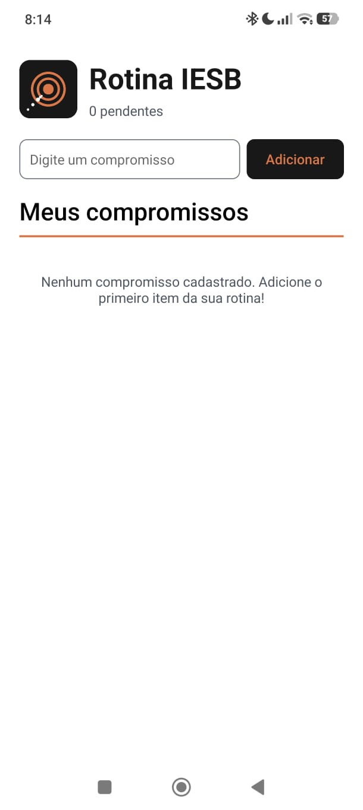
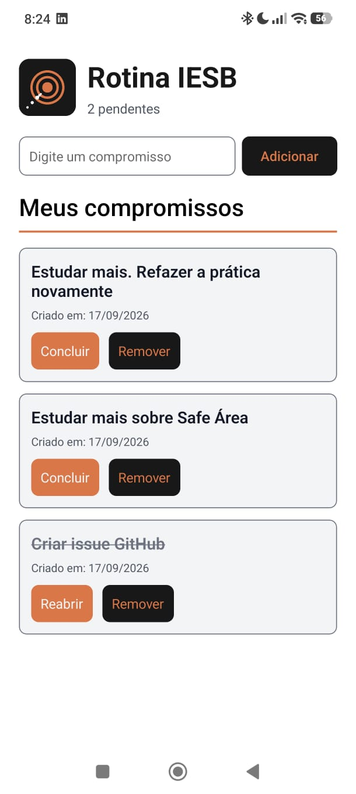

# Prática 06 — RotinaIESB

**Disciplina:** Programação para Dispositivos Móveis (React Native / Expo)<br>
**Professor:** Marcelo Alves Farias — IESB<br>
**Aulas relacionadas:** 02, 03, 04, 05 e 06

## Objetivo e enunciado

Consolidar em um único aplicativo os assuntos vistos nas aulas: estrutura de projeto Expo, import/export, componentes nativos, `StyleSheet`, Flexbox, `useState`, props, `Pressable`, `useEffect`, AsyncStorage e persistência em JSON.

O app desenvolvido foi o **RotinaIESB**, um organizador simples da rotina acadêmica. Nele é possível cadastrar compromissos do dia, concluir ou reabrir um item, remover itens e manter a lista ao fechar o aplicativo.

### Requisitos atendidos

- Arquivo `labels.js` com export nomeado para os textos usados no app.
- Cabeçalho em linha com imagem local e título.
- Formulário em linha com `TextInput` e `Pressable` de adicionar.
- `useState` para o texto digitado e o array de compromissos.
- Componentes `CompromissoInput.js` e `CompromissoList.js` recebendo props.
- Lista com `FlatList`, chave estável baseada no `id` e remoção com `filter`.
- Validação de campo vazio com `Alert` e feedback visual de toque.
- Persistência com AsyncStorage, `useEffect`, `JSON.stringify` e `JSON.parse`.

### Desafio opcional incluído

Foi incluída a opção de marcar um compromisso como concluído. O texto fica riscado e o cabeçalho mostra a quantidade de pendências.

## Estrutura do projeto

```text
pratica06/
├── issue.md
├── README.md
└── RotinaIESB/
    ├── App.js
    ├── app.json
    ├── index.js
    ├── labels.js
    ├── package.json
    ├── assets/
    │   └── logo.png
    ├── components/
    │   ├── CompromissoInput.js
    │   └── CompromissoList.js
    └── styles/
        └── colors.js
```

## Como executar

O projeto foi criado com o template blank do Expo:

```bash
npx create-expo-app@latest RotinaIESB --template blank
cd RotinaIESB
npx expo install @react-native-async-storage/async-storage react-native-safe-area-context
```

Para iniciar:

```bash
cd praticas/pratica06/RotinaIESB
npm install
npx expo start
```

## Layout e componentes

O `App.js` organiza a tela em três partes: cabeçalho, formulário e lista. O cabeçalho e o formulário usam `flexDirection: 'row'`. No formulário, o campo usa `width: '68%'` e o botão `width: '30%'`. A lista usa `flex: 1` para ocupar o espaço restante da tela.

Os textos ficam centralizados em `labels.js`, que usa export nomeado e é importado no `App.js`. O formulário está em `components/CompromissoInput.js` e a lista em `components/CompromissoList.js`.

## Onde está a persistência

Em `RotinaIESB/App.js`, o primeiro `useEffect`, com `[]`, chama `carregarCompromissos()` quando o aplicativo abre. A função lê a chave `@rotina_iesb_compromissos`, usa `JSON.parse` e atualiza o estado da lista.

O segundo `useEffect`, com `[compromissos, carregado]`, salva a lista sempre que ela muda. Ele usa `JSON.stringify` e `AsyncStorage.setItem`. O estado `carregado` evita que a lista vazia inicial seja salva antes de a leitura terminar. Os dois processos usam `try/catch` e mostram mensagens amigáveis caso ocorra algum erro.

Adicionar, remover e concluir alteram o estado com novos arrays. O salvamento fica concentrado no efeito, sem colocar AsyncStorage nos botões.

## Prints e verificação

Capturas reais feitas no Expo Go, incluindo a conferência da persistência após fechar e abrir o aplicativo.

### Tela vazia



### Lista com itens



### Lista com itens reaberta


### Verificações realizadas

- Adição de compromisso e limpeza do campo após adicionar.
- Bloqueio de entrada vazia ou apenas com espaços.
- Conclusão e reabertura de um compromisso, com atualização do contador.
- Remoção de um item sem alterar os demais.
- Rolagem da lista com vários compromissos.
- Persistência da lista ao reabrir o aplicativo.
